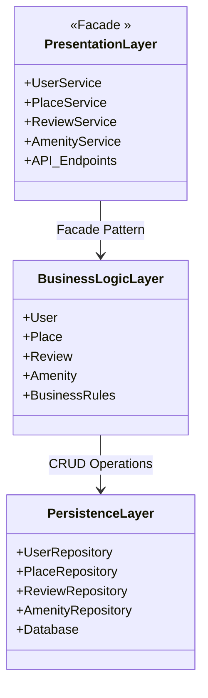
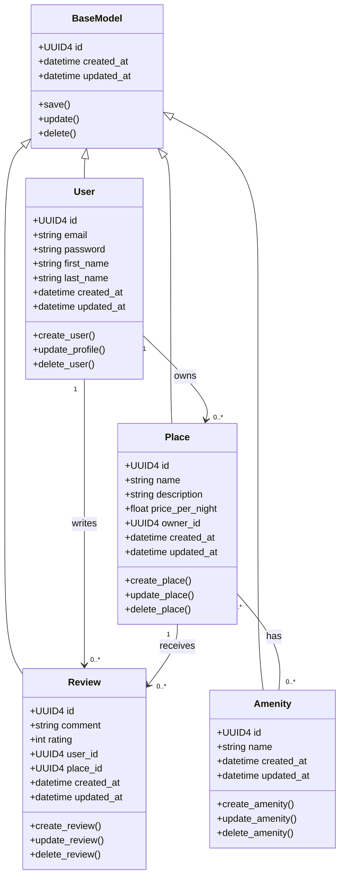
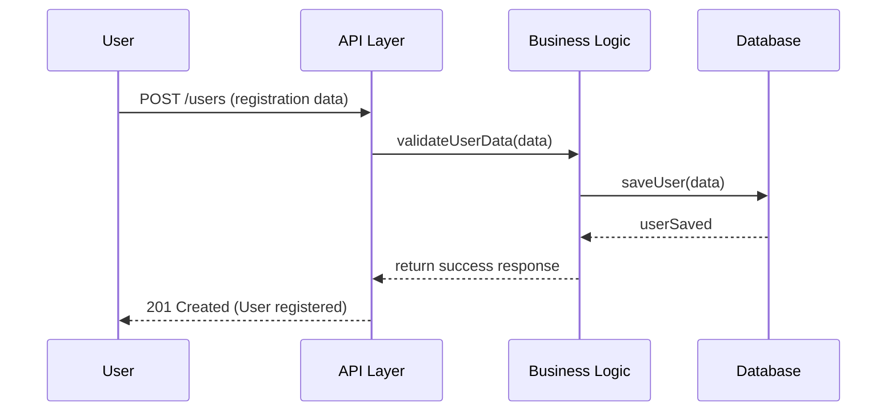
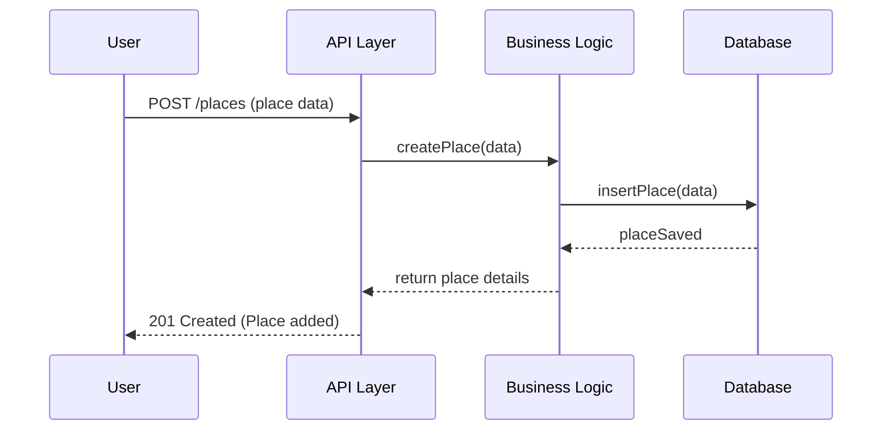
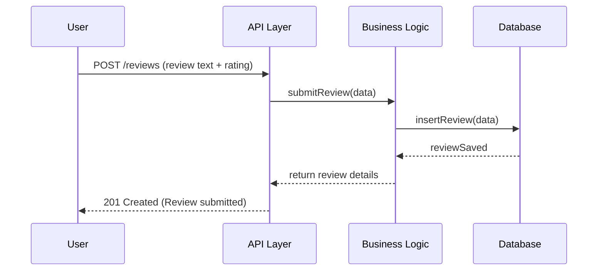
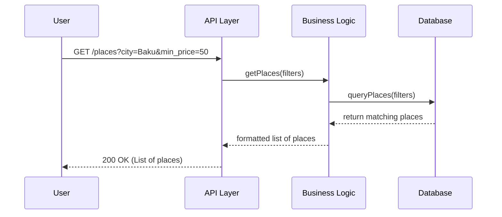

HBnB Application Technical Documentation

The HBnB application is a simplified AirBnB-like platform that allows users to register, create and browse places, submit reviews, and manage amenities. This technical document serves as a comprehensive blueprint for the project, detailing the systems architecture, the design of the Business Logic layer, and the interactions within the application through API calls.

This document will guide developers through the implementation phase and serve as a reference for understanding the system's design decisions.
-------------------------
High-Level Architecture

HBnB uses a three-layer architecture:

Presentation Layer: Handles user interactions through APIs.

Business Logic Layer: Contains core entities and business rules.

Persistence Layer: Responsible for data storage and retrieval.

The Facade Pattern is applied in the Presentation Layer to simplify communication with the Business Logic Layer, ensuring that the API endpoints do not directly manipulate business entities or repositories.

Package Diagram

Explanatory Notes:

PresentationLayer exposes services through API endpoints and uses a facade to communicate with the Business Logic Layer.

BusinessLogicLayer implements the application's core logic and rules.

PersistenceLayer manages all interactions with the database, abstracting the CRUD operations from the business logic.

--------------------------------

Class Diagram

The Business Logic Layer encapsulates the main entities of the application and their relationships. It ensures consistency, enforces business rules, and coordinates interactions with the Persistence Layer.

-------------------------------------------
BaseModel - All models use this.

User - Represents a user, a user can create places and write reviews.

Place - Represents a place listed by a user, belongs to one user, can have many reviews, and many amenities.

Amenity - Represents a feature of a place.

------------------------------------------

Sequence Diagrams

User submits registration data.
API Layer validates and forwards the request to Business Logic.
Business Logic saves the user through the Persistence Layer.

## 2. Place Creation

Users create new places.
Business Logic ensures that the place is associated with the correct user and persists it via the database.

## 3. Review Submission

Users submit reviews for places.
Business Logic ensures correct linkage to User and Place entities.

## 4. Fetching List of Places

Users fetch available places using filters.
Business Logic applies the filtering and retrieves matching places from the database.

------------------------------------

This document provides a clear, structured view of the HBnB application:

Architecture: Three-layered, with Facade Pattern in Presentation Layer.
Business Logic Layer: Detailed class diagram with entity relationships.
API Interaction: Sequence diagrams illustrating core use cases.