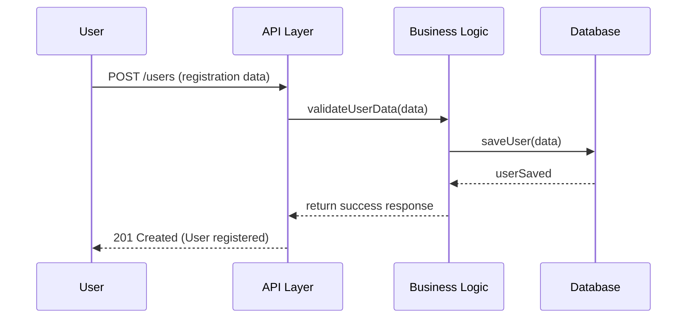
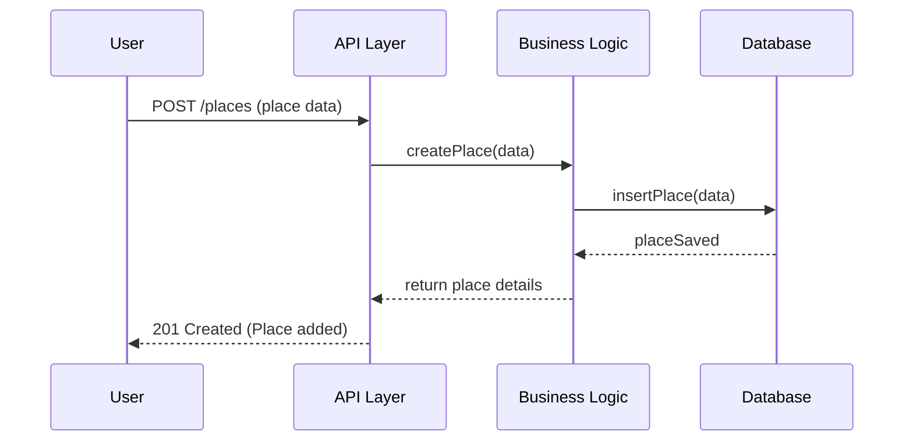
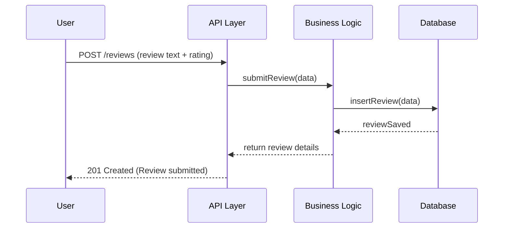
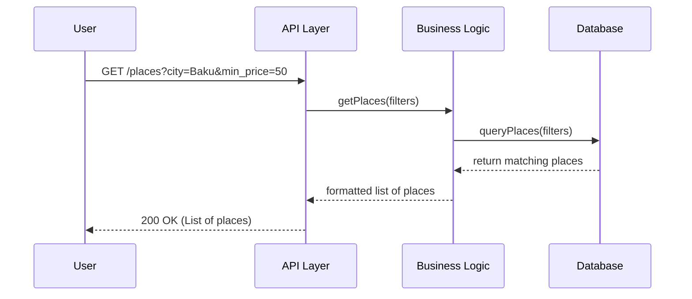

# HBnB API Sequence Diagrams

## 1. User Registration

### **Sequence Diagram**

```mermaid
sequenceDiagram
    participant User
    participant API as API Layer
    participant BL as Business Logic
    participant DB as Database

    User->>API: POST /users (registration data)
    API->>BL: validateUserData(data)
    BL->>DB: saveUser(data)
    DB-->>BL: userSaved
    BL-->>API: return success response
    API-->>User: 201 Created (User registered)
```

## 2. Place Creation

```mermaid
sequenceDiagram
    participant User
    participant API as API Layer
    participant BL as Business Logic
    participant DB as Database

    User->>API: POST /places (place data)
    API->>BL: createPlace(data)
    BL->>DB: insertPlace(data)
    DB-->>BL: placeSaved
    BL-->>API: return place details
    API-->>User: 201 Created (Place added)
```

## 3. Review Submission

```mermaid
sequenceDiagram
    participant User
    participant API as API Layer
    participant BL as Business Logic
    participant DB as Database

    User->>API: POST /reviews (review text + rating)
    API->>BL: submitReview(data)
    BL->>DB: insertReview(data)
    DB-->>BL: reviewSaved
    BL-->>API: return review details
    API-->>User: 201 Created (Review submitted)
```

## 4. Fetching List of Places

```mermaid
sequenceDiagram
    participant User
    participant API as API Layer
    participant BL as Business Logic
    participant DB as Database

    User->>API: GET /places?city=Baku&min_price=50
    API->>BL: getPlaces(filters)
    BL->>DB: queryPlaces(filters)
    DB-->>BL: return matching places
    BL-->>API: formatted list of places
    API-->>User: 200 OK (List of places)
```